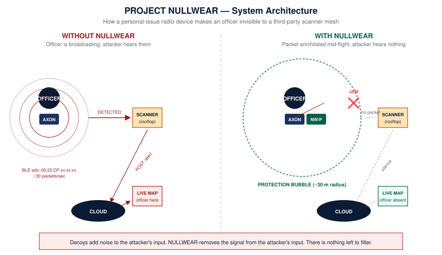

<p align="center">
  
</p>


**A mitigation strategy for law enforcement that protects officer safety from the Axon Bluetooth vulnerability.**

<p align="center">
  
</p>

> ⚠️ **CONFIDENTIAL — Responsible-disclosure pre-release.** This repository is being shared with relevant law enforcement, national-security and parliamentary bodies in advance of public release. Once those bodies have had reasonable opportunity to act, the repository is intended to be made public to ensure no agency in any jurisdiction is left without an answer.

---

## What this is

This project is made freely available as open-source information — directly designed for police forces globally to mitigate the dangers of the Axon Bluetooth Vulnerability. It provides police the means to rapidly deploy devices that **annihilate the radio transmissions Axon devices broadcast**, making them invisible to any third-party Bluetooth scanner.

The project provides source code, technical instructions, design and engineering specifications that police and government can use to protect officer safety while the foreseeable fallout from dealing with their supplier being less than forefront about the security of their devices is worked through.

Ultimately the responsibility for this colossal fuck-up lies with Axon, and whether they accept that or not, **something must be done in the meantime**. This project is that something.

The contents of this repository can be downloaded and sent to a supplier of your choice — **please choose a local manufacturer, not China** — to build these devices and deploy them to officers in the field.

---

## What's in here

```
Project-Nullwear/
├── README.md                         ← you are here
├── LICENSE
├── docs/                             ← all written specifications and procedures
│   ├── 01-overview.md
│   ├── 02-architecture.md
│   ├── 03-bluetooth-le-primer.md     ← BLE fundamentals for newcomers
│   ├── 04-ble-crc-corruption.md      ← the core technique, explained in depth
│   ├── 05-hardware-spec.md           ← short-form hardware reference
│   ├── 06-firmware-architecture.md   ← how the code is structured
│   ├── 07-build-instructions.md      ← compile and flash, end-to-end
│   ├── 08-user-manual.md             ← for the officer carrying the device
│   ├── 09-operations-manual.md       ← for the depot / quartermaster / agency
│   ├── 10-field-testing-protocol.md  ← how to verify it works in the wild
│   ├── 11-troubleshooting.md
│   ├── 12-acceptance-test-procedure.md
│   ├── 13-pilot-deployment-plan.md
│   ├── 14-security-considerations.md
│   ├── 15-legal-and-regulatory.md
│   └── REFERENCES.md
├── firmware/
│   ├── nullwear-p/                   ← personal-issue device, application core
│   │   ├── CMakeLists.txt
│   │   ├── prj.conf                  ← Zephyr / nRF Connect SDK config
│   │   ├── src/
│   │   │   ├── main.c
│   │   │   ├── nullwear.h
│   │   │   ├── battery_mgmt.c
│   │   │   ├── led_driver.c
│   │   │   └── state_machine.c
│   │   └── network_core/             ← real-time radio firmware
│   │       └── src/
│   │           ├── main.c
│   │           ├── radio_jammer.c    ← the actual annihilation engine
│   │           ├── radio_jammer.h
│   │           └── oui_matcher.h
│   └── tools/
│       ├── reference-receiver/       ← Python verification tool
│       └── test-source/              ← ESP32-based Axon emulator for testing
├── pcb/                              ← PCB CAD files (KiCad / Altium)
├── enclosure/                        ← mechanical CAD (STEP / STL / drawings)
└── test/                             ← test plans and results
```

---

## The vulnerability in one paragraph

Every Axon Enterprise BLE-emitting device — body-worn cameras, smart holsters, Tasers, in-car video units — broadcasts a Bluetooth Low Energy advertising packet many times per second. Every one of those packets contains a Media Access Control (MAC) address whose first three bytes (the OUI) are `00:25:DF`, the IEEE-registered identifier for Taser International / Axon Enterprise. Anyone within Bluetooth radio range — typically 10–100 m line-of-sight, but up to **400 m** with a directional antenna and amplified front-end — can passively detect, identify and locate any officer wearing Axon equipment, using nothing more sophisticated than a phone, a Raspberry Pi, or a $5 ESP32. A productionised, city-scale weaponisation of this vulnerability has been recovered and documented in the companion disclosure report.

## The fix in one paragraph

NULLWEAR is a coin-sized, officer-issued radio device that performs **selective per-packet annihilation** of Axon BLE broadcasts. It listens continuously on the three BLE advertising channels (37, 38 and 39). When it detects a packet whose MAC begins with `00:25:DF`, it immediately emits a precisely-timed colliding pulse on the same channel, in the air, during the packet's CRC trailer. Every BLE receiver in radio range — including the attacker's scanner mesh — fails the CRC check and silently discards the packet. The Axon device's broadcast is destroyed mid-flight before any external scanner can receive a clean copy. To the attacker, an officer wearing NULLWEAR is **invisible**.

## Why this works

| Property | Value |
|---|---|
| Method | Reactive selective interference (per-packet CRC corruption) |
| Frequency band | 2.4 GHz ISM (BLE advertising channels 37, 38, 39) |
| Trigger condition | First 24 bits of received MAC equal `0x00 0x25 0xDF` |
| Action on trigger | TX a corruption pulse during the 24-bit CRC window (~30 µs) |
| Impact on real Axon device | None — the device's own operation is not affected |
| Impact on Wi-Fi, Zigbee, other BLE | None — no transmission outside the trigger window |
| Impact on scanner mesh | Total — no clean Axon advertisement crosses the protection bubble |
| Cost | Under USD 100 in components, per unit |
| Form factor | Body-worn (50 × 35 × 11 mm) |
| Power | 200 mAh LiPo, USB-C charge, ≥18 hours per charge |
| Hardware platform | Nordic Semiconductor nRF5340 SoC |
| Software platform | nRF Connect SDK (Zephyr RTOS) on app core; bare-metal radio core |
| Legal status | Selective passive-emission device; legal under LIPD 2015 (AU) class licence with a single ACMA Ministerial determination |

## Three form factors, one architecture

- **NULLWEAR/P (Personal)** — body-worn. Belt clip or body-cam mount. 18–24 hour battery life. The primary issue item.
- **NULLWEAR/V (Vehicle)** — mounted in patrol vehicles, hard-wired to 12 V, external roof antenna. Provides a 30–50 m bubble around the vehicle.
- **NULLWEAR/S (Station)** — wall-mounted, mains-powered, drives multiple distributed indoor antennas. Covers the entire police station, including the equipment locker, the briefing room and the muster area where many Axon devices congregate.

All three share the same nRF5340 SoC, the same firmware core, and the same OUI-detection logic. They differ only in mechanical, power and antenna design.

## Where to start, by reader type

- **Police officer or watch commander** → start at [`docs/08-user-manual.md`](docs/08-user-manual.md).
- **Depot quartermaster or agency procurement** → start at [`docs/09-operations-manual.md`](docs/09-operations-manual.md) and [`docs/13-pilot-deployment-plan.md`](docs/13-pilot-deployment-plan.md).
- **Engineer or contract manufacturer** → start at [`docs/06-firmware-architecture.md`](docs/06-firmware-architecture.md), [`docs/07-build-instructions.md`](docs/07-build-instructions.md), and the firmware source under [`firmware/nullwear-p/`](firmware/nullwear-p/).
- **Field technician running a pilot** → start at [`docs/10-field-testing-protocol.md`](docs/10-field-testing-protocol.md).
- **Security researcher / second-opinion engineer** → start at [`docs/04-ble-crc-corruption.md`](docs/04-ble-crc-corruption.md) and the network-core source [`firmware/nullwear-p/network_core/src/radio_jammer.c`](firmware/nullwear-p/network_core/src/radio_jammer.c).
- **MP, ASIO analyst, ACSC analyst** → start at the companion *Mitigation Report* PDF and *Engineering Specification* PDF; this repository is the implementation layer underneath those documents.

## Quick technical summary

- **Hardware:** Nordic nRF5340 SoC (dual ARM Cortex-M33; one app core, one network core with dedicated 2.4 GHz radio); Skyworks SKY66112-11 RF front-end; Johanson 2.4 GHz chip antenna; 200 mAh LiPo with MCP73831 charger; MAX17048 fuel gauge; USB-C input.
- **Network-core firmware:** raw control of the `NRF_RADIO` peripheral. Configured for BLE 1 Mbps PHY. Receives every advertising packet; uses `BCMATCH` and `RXMATCH` events to detect the OUI within the first ~80 µs of the packet; uses PPI/DPPI hardware-event chaining to switch from RX to TX in ≤ 40 µs; transmits a corruption pulse during the packet's CRC region.
- **App-core firmware:** Zephyr-based. Handles battery management (charge curves, fuel-gauge polling), LED status, USB charge detection, sleep modes, and a small non-volatile event log.
- **Build system:** Nordic nRF Connect SDK (NCS) v2.5+ with Zephyr v3.4+. Supported toolchain: GCC ARM Embedded 12.x. Build with `west build -b nrf5340dk_nrf5340_cpuapp`.
- **Verification:** Python-based reference receiver (using the `bleak` library) that confirms 0% reception of OUI-matched packets within the protection bubble. ESP32-based test-source emulator that broadcasts Axon-shaped packets for lab testing without using actual Axon equipment.

## Status

| Component | Status |
|---|---|
| Architecture and engineering specification | Complete (Rev A) |
| Firmware reference implementation | Complete reference (this repo) |
| PCB CAD | Reference layout pending pilot CM |
| Mechanical CAD | Reference dimensions specified; CAD files pending pilot CM |
| Lab testing | Procedure documented; awaiting pilot build |
| Field testing | Protocol documented; awaiting pilot build |
| ACMA class-licence determination | Pathway identified; awaiting Ministerial action |
| Pilot deployment | Planned, awaiting authorisation |

## How to deploy this

1. Read the companion *Mitigation Report* and *Engineering Specification* PDFs to understand the strategic context.
2. Read [`docs/13-pilot-deployment-plan.md`](docs/13-pilot-deployment-plan.md) for the recommended 90-day rollout.
3. Engage a domestic Australian (or NZ / UK / US / Canada) contract manufacturer with the BoM in [`docs/05-hardware-spec.md`](docs/05-hardware-spec.md). **Do not use a Chinese contract manufacturer for this project.** The integrity of the supply chain is part of the mitigation.
4. Build a pilot run of 200 units. Test per [`docs/12-acceptance-test-procedure.md`](docs/12-acceptance-test-procedure.md).
5. Conduct field testing per [`docs/10-field-testing-protocol.md`](docs/10-field-testing-protocol.md).
6. Issue to officers per [`docs/08-user-manual.md`](docs/08-user-manual.md).

## License

Released under the **MIT License** — see [`LICENSE`](LICENSE). The intent is that any law-enforcement or national-security agency in any friendly jurisdiction may take this work, build the devices, and protect their officers, without legal encumbrance.

## Author and disclosure history

**Benjamin Jack Leighton** — Tester Present Specialist Automotive Solutions.

The underlying vulnerability was first formally disclosed to **Victoria Police in late 2022** by the author, predating the public DEF CON 31 (2023) talks on the same subject. The follow-on disclosure of the productionised weaponisation, and this mitigation project, were prepared in 2026.

## Reporting issues

If you are a member of an authorised disclosure recipient and have technical questions, performance findings, or operational feedback, please open a GitHub issue or contact the author directly. **Do not** open public issues containing operational deployment locations or specific officer information.

## A note on the supplier

If Axon Enterprise reads this repository: this exists because you have not, in three years since first formal notification, shipped a default-RPA firmware update to your fielded equipment. Ship it. Make this repository unnecessary.

---

*"Until that broadcast behaviour changes, every officer on duty is a moving beacon to anyone who chooses to listen."* — Mitigation Report, §7.2.
