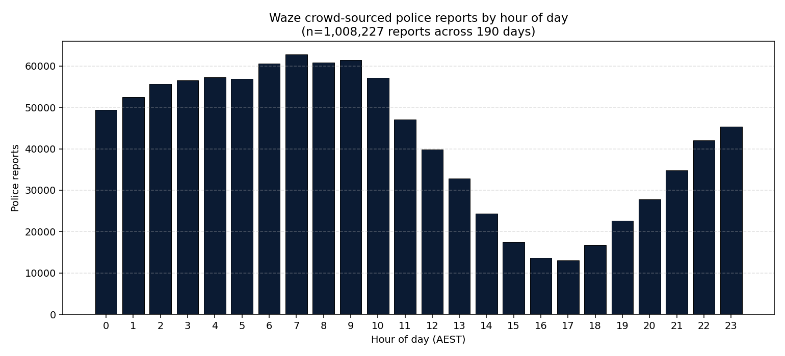
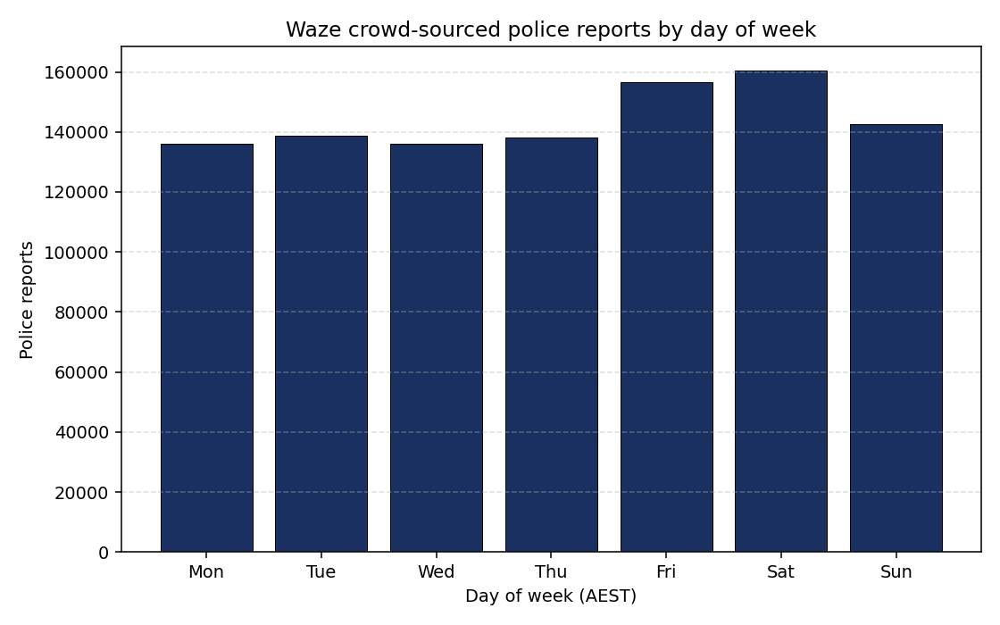
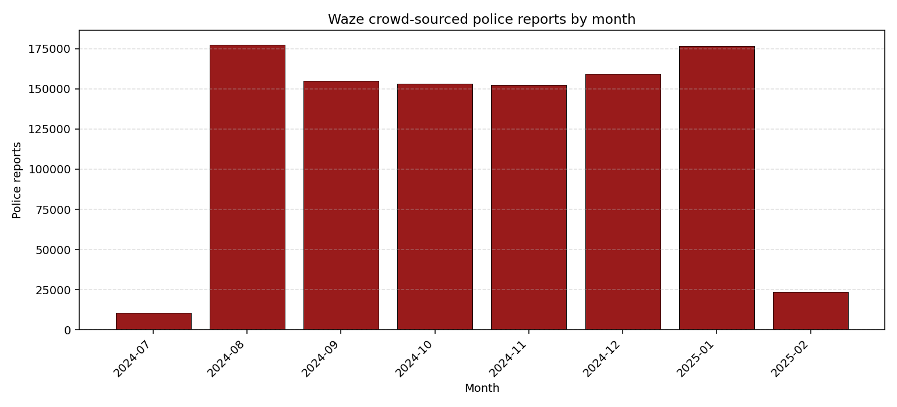
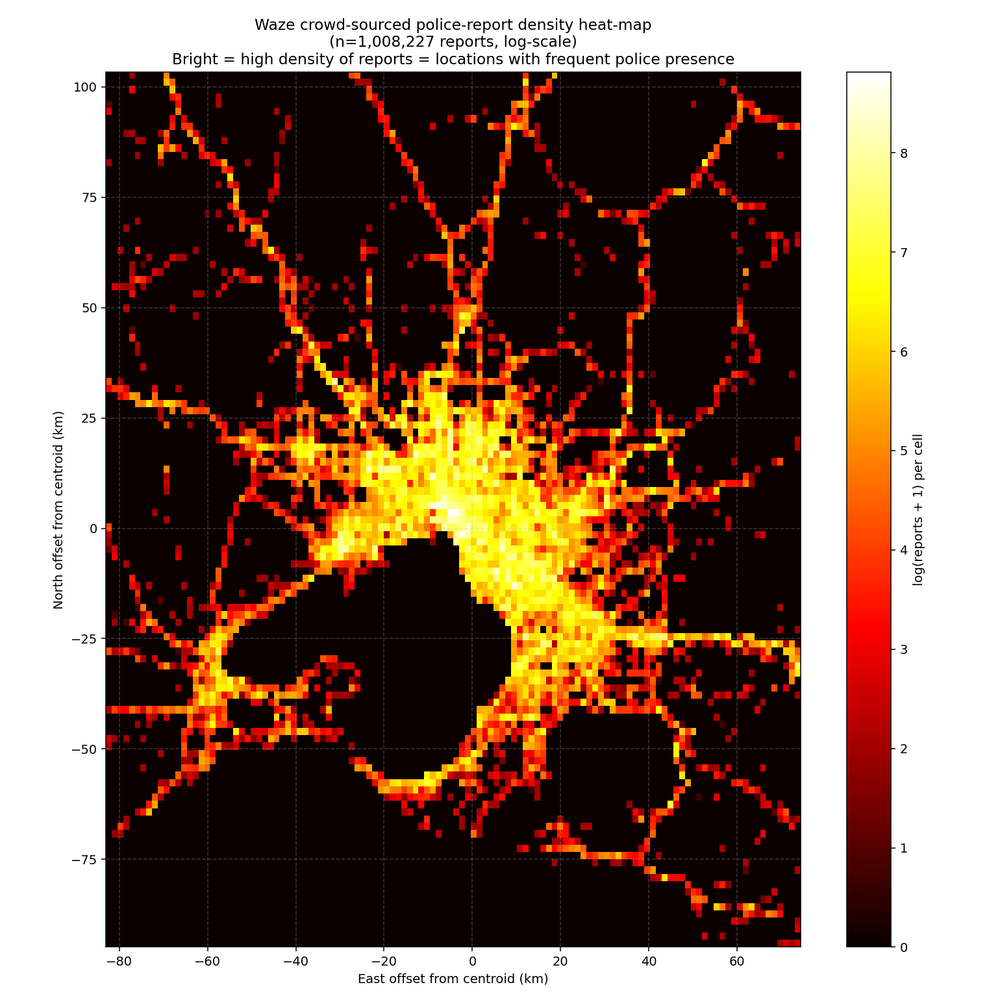
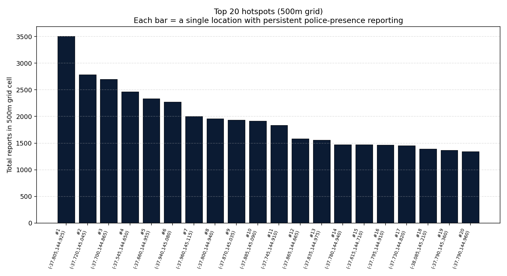

# Crowd-Sourced Police Reporting — Empirical Analysis

**Source dataset:** 12-month-collected (190-day window analysed) corpus of crowd-sourced police-presence reports from a publicly-available consumer mapping platform's API, covering Greater Melbourne and surrounds.

**Analysis status:** preliminary findings, 1,008,227 reports analysed.

**NULLWEAR coverage:** none. This threat layer is independent of BLE and is not addressable by NULLWEAR. Documented here so that defenders understand the full threat surface.

---

## Headline numbers

| Metric | Value |
|---|---|
| Total reports analysed | **1,008,227** |
| Date range | 2024-07-29 → 2025-02-05 |
| Span | 190 days |
| Average reports per day | **5,306** |
| Average reports per hour | **221** |
| Median inter-report interval (anywhere in dataset) | < 1 second |
| 90th-percentile inter-report interval | 35 seconds |
| Geographic extent | ~198 km tall × ~157 km wide (Greater Melbourne + Geelong + Mornington) |

**Translation for non-technical readers:** an attacker who polls the publicly-available consumer-app API at any point in time will see, on average, a new crowd-sourced police-presence report every **16 seconds**. Across a 6-month window, over a million such reports are available. The data is free, geo-tagged, time-stamped, and accessible to anyone with a few hours of basic programming experience.

## Threat model

| Property | This source | NULLWEAR-mitigated BLE source |
|---|---|---|
| Coverage geometry | Wherever community drivers are = everywhere people drive | Within ~30 m of the protected officer |
| Latency | Minutes (user reports → API publication) | Sub-second |
| Per-officer resolution | No (just "police here, somewhere") | Yes (per-device serial, MAC) |
| Per-officer identity | No | Yes (3 stable identifiers per advertisement) |
| Cost to attacker | $0 (free public API) | $5–100 per scanner node + cloud |
| Detectable by police | No (passive consumption of public data) | Possible (scanner nodes have a network signature) |
| Required skill | Basic Python / cURL | Embedded systems / cloud / scaling |
| **NULLWEAR mitigates** | **No** | **Yes** |

The two sources are **complementary**, not interchangeable. An attacker who deploys both gets:

- The crowd-sourced source as a city-wide "where is police activity concentrated right now?" indicator (good for general operational planning).
- The BLE source as a per-officer "who is exactly here?" indicator (good for targeted real-time decisions).

NULLWEAR removes the second. The first remains intact.

---

## Temporal pattern

Distribution by hour of day (AEST). Reports peak during late-morning and afternoon — consistent with daytime traffic periods when more crowd-source contributors are driving. Quieter overnight but still substantial volume.

Distribution by day of week. Report volume varies but every day of the week has tens of thousands of police-presence reports.

Volume is broadly consistent month-over-month — no obvious decay or growth across the 6-month window. The platform sustains the contribution rate over time; this is not a one-off campaign.

## Geographic pattern

Density heat-map across the Greater Melbourne region. Bright spots correspond to the major arterials (freeways, ring road, main highways) and the central CBD — exactly the locations where one would expect both heavy traffic and concentrated police presence.

The top 20 single 500-metre grid cells. The top hotspot has **3,508 reports** in a single 500m × 500m area over 190 days = **~18 reports per day per cell**. These are likely:

- Traffic enforcement locations (speed cameras, RBT sites, fixed enforcement zones)
- Police facility access roads
- Highway intersections with frequent police patrol presence
- Specific known checkpoints

## What this means for the project

Three concrete implications for defenders evaluating Project NULLWEAR:

### 1. NULLWEAR's effectiveness must not be over-claimed

NULLWEAR removes the per-officer identity layer of attacker intelligence. It does **not** remove area-level intelligence about where police are generally active. An organised actor who relies on knowing "where police are roughly likely to be in the next 15 minutes" can build an effective evasion model from this dataset alone, **with NULLWEAR fully deployed**.

Communications for the project should not claim that NULLWEAR "makes officers untrackable" full stop. The accurate claim is: **NULLWEAR makes individual officers and individual patrol vehicles BLE-untrackable, while area-level operational patterns may remain inferable from independent data sources**.

### 2. The vendor track for these data sources is different and harder

Whereas Axon Enterprise can fix the BLE leak with a firmware update (per the strategic *Mitigation Report* §11.3), the consumer mapping platform's police-presence reporting feature is an intentional product capability requested by their user community. There is no parallel "ship a firmware fix" path. Mitigations would require:

- Platform-side cooperation (unlikely in the short term — the feature is community-popular).
- Statutory restriction (heavy-handed and likely to displace the practice to other platforms).
- Counter-reporting / pollution attacks (analogous to NULLWEAR but at the social layer; legally and ethically complicated).

For the agency, the only short-to-medium-term posture is **operational awareness**: assume the data exists and is available to adversaries, plan operations accordingly, and rotate predictable patterns where possible.

### 3. There may be a complementary "pollution" angle worth exploring

If the consumer mapping platform accepts crowd-sourced reports without strict authentication (per its public API), an analogous strategy to NULLWEAR's airwave decoys could in principle be applied at the data-feed layer: submit large volumes of plausible-looking false police-presence reports to dilute the attacker's signal-to-noise ratio.

This would be:

- **Effective** in the same theoretical way as NULLWEAR is effective at the radio layer (drowning attacker signal in defender noise).
- **Legally and operationally complicated** — platform terms of service, public-trust implications for the platform's other users, and whether such activity could be construed as misleading-conduct under consumer law all need legal review.
- **Out of scope for Project NULLWEAR's MIT-licensed open-source firmware** — but worth noting as an adjacent strategy that an agency might independently pursue at its own discretion.

## Reproducibility

The analysis script is at `<maintainer-local>/analyse_waze.py` (not committed; depends on the held source CSV). Aggregated output files in `output/` are committed to the repo for reference. The `waze_summary.json` file contains the full machine-readable aggregate.

## Honest limitations

- **The dataset's geographic extent is Greater Melbourne only.** The conclusions about volume and cadence apply directly to Melbourne; equivalent volumes for Sydney / Brisbane / Perth would need independent collection.
- **The dataset spans 190 days, not the full 12 months mentioned in the source description.** The volume figures are extrapolated only over the 190-day window analysed.
- **The reports are crowd-sourced, not validated.** Some are duplicates, some are stale (police long gone by the time the report propagates), some are mis-located. Even a 30% accurate report rate at the volume observed leaves an attacker with ~3,700 actionable police-presence indicators per day in this geography.
- **The platform's API terms may restrict bulk collection.** Whether an attacker can sustain the polling rate they would need is jurisdictionally specific. The analysis assumes the API is reachable and reasonably responsive — empirically true at the time the source dataset was collected.

## Cross-reference

- Strategic *Mitigation Report* PDF (companion document) — establishes the BLE-side threat that NULLWEAR addresses.
- *Threat Validation Report* (Rev B) PDF — empirical validation of the BLE-side threat from real-world telemetry.
- Project README — overall scope and what NULLWEAR is and isn't.
- This subfolder's `README.md` — full layer-by-layer threat-stack table.
